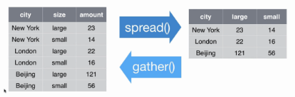

> Reiniciar R

# Manipulación de Bases de Datos
         

A lo largo de esta clase, trabajaremos con el paquete [Tidyverse](https://www.tidyverse.org/). El mismo agrupa una serie de paquetes que tienen una misma lógica en su diseño y por ende funcionan en armonía.     
Entre ellos usaremos principalmente __dplyr__ y __tidyr__ para realizar transformaciones sobre nuestro set de datos, y __ggplot__ para realizar gráficos (éste último se verá en la clase 3).

A continuación cargamos la librería a nuestro ambiente. Para ello debe estar previamente instalada en nuestra pc.
```{r, warning=FALSE,message=FALSE}
library(tidyverse)
```

Para mostrar el funcionamiento básico de tydyverse retomaremos el ejemplo de la clase 1, con lo cual volvemos a crear el set de datos del [Indice de salarios](http://www.indec.gob.ar/bajarCuadroEstadistico.asp?idc=4020B33440609462654542BD0BC320F1523DA0DC52C396201DB4DD5861FFEDC9AD1436681AC84179).
```{r}
INDICE  <- c(100,   100,   100,
             101.8, 101.2, 100.73,
             102.9, 102.4, 103.2)

FECHA  <-  c("Oct-16", "Oct-16", "Oct-16",
             "Nov-16", "Nov-16", "Nov-16",
             "Dic-16", "Dic-16", "Dic-16")


GRUPO  <-  c("Privado_Registrado","Público","Privado_No_Registrado",
             "Privado_Registrado","Público","Privado_No_Registrado",
             "Privado_Registrado","Público","Privado_No_Registrado")

Datos <- data.frame(INDICE, FECHA, GRUPO)


```


## Dplyr

El caracter principal para utilizar este paquete es ```%>%``` , _pipe_ (de tubería).

Los ```%>%``` toman el set de datos a su izquierda, y los transforman mediante los comandos a su derecha, en los cuales los elementos de la izquierda están implícitos. Es decír, que una vez específicado el DataFrame con el cual se trabaja, no será necesario nombrarlo nuevamente para referirse a una determinada variable/columna del mismo.

Veamos las principales funciones que pueden utilizarse con la lógica de este paquete:

### filter

Permite filtrar la tabla acorde al cumplimiento de condiciones lógicas
 
```{r}
Datos %>% 
  filter(INDICE>101 , GRUPO == "Privado_Registrado")

```
Nótese que en este caso al separar con una  ```,``` las condiciones se exige el cumplimiento de ambas. En caso de desear que se cumpla una sola condición debe utilizarse el caracter ```|```
```{r}
Datos %>% 
  filter(INDICE>101 | GRUPO == "Privado_Registrado")
```

### rename
Permite renombrar una columna de la tabla. Funciona de la siguiente manera: 
 ```Data %>% rename( nuevo_nombre = viejo_nombre )``` 
```{r}
Datos %>% 
  rename(Periodo = FECHA)
```
Nótese que a diferencia del ejemplo de la función __filter__ donde utilizábamos __==__ para comprobar una condición lógica, en este caso se utiliza sólo un __=__ ya que lo estamos haciendo es _asignar_ un nombre.

### mutate
Permite agregar una variable a la tabla (especificando el nombre que tomará esta), que puede ser el resultado de operaciones sobre otras variables de la misma tabla.       

En caso de especificar el nombre de una columna existente, el resultado de la operación realizada "sobrescribirá" la información de la columna con dicho nombre
```{r}
Datos <- Datos %>% 
  mutate(Doble=INDICE*2)
Datos
```

### case_when
Permite definir una variable, la cual toma un valor particular para cada condición establecida. En caso de no cumplir ninguna de las condiciones establecidas la variable tomara valor __NA__.         
Su funcionamiento es el siguiente:      
```case_when(condicion1 ~ "Valor1",condicion2 ~ "Valor2",condicion3 ~ "Valor3")```

```{r}
Datos <- Datos %>% 
  mutate(Caso_cuando = case_when(GRUPO == "Privado_Registrado"   ~ INDICE*2,
                                 GRUPO == "Público"              ~ INDICE*3,
                                 GRUPO == "Privado_No_Registrado"~ INDICE*5))
Datos
```

### select
Permite especificar la serie de columnas que se desea conservar de un DataFrame. También pueden especificarse las columnas que se desean descartar (agregándoles un _-_). Muy útil para agilizar el trabajo en bases de datos de gran tamaño.
```{r}
Datos2 <- Datos %>% 
  select(INDICE, FECHA, GRUPO)
Datos2

Datos <- Datos %>% 
  select(-c(Doble,Caso_cuando))
Datos
```

### arrange
Permite ordenar la tabla por los valores de determinada/s variable/s. Es útil cuando luego deben hacerse otras operaciones que requieran del ordenamiento de la tabla
```{r}
Datos <- Datos %>% 
  arrange(GRUPO, INDICE)
Datos
```

### summarise
Crea una nueva tabla que resume la información original. Para ello, definimos las variables de resumen y las formas de agregación.
```{r}
Datos %>% 
  summarise(Indprom = mean(INDICE))

```

### group_by
Esta función permite realizar operaciones de forma agrupada. Lo que hace la función es "separar" a la tabla según los valores de la variable indicada y realizar las operaciones que se especifican a  continuación, de manera independiente para cada una de las "subtablas". En nuestro ejemplo, sería útil para calcular el promedio de los indices por _Fecha_ 
```{r}
Datos %>% 
  group_by(FECHA) %>%
  summarise(Indprom = mean(INDICE))
```
Notese que los ```%>%``` pueden usarse encadenados para realizar numerosos procedimientos sobre un dataframe original.
Veamos un ejemplo con multiples encadenamietnos
```{r}
Encadenado <- Datos %>% 
  filter(GRUPO == "Privado_Registrado") %>% 
  rename(Periodo = FECHA) %>% 
  mutate(Doble = INDICE*2) %>% 
  select(-INDICE)
  
```

## Joins

Otra implementación muy importante del paquete dplyr son las funciones para unir tablas (joins)


         

###left_join    

Veamos un ejemplo de la función __left_join__ (una de las más utilizadas en la práctica).       
Para ello crearemos previamente un Dataframe que contenga un Ponderador para cada uno de los Grupos del Dataframe _Datos_. Aprovecharemos el ejemplo para introducir la función __weigthed.mean__, y así calcular un Indice Ponderado.

```{r}
Ponderadores <- data.frame(GRUPO = c("Privado_Registrado","Público","Privado_No_Registrado"),
                            PONDERADOR = c(50.16,29.91,19.93))
Ponderadores
```

```{r}
Datos_join <- Datos %>% 
  left_join(.,Ponderadores, by = "GRUPO")
Datos_join

Datos_Indice_Gral <- Datos_join %>% 
  group_by(FECHA) %>% 
  summarise(Indice_Gral = weighted.mean(INDICE,w = PONDERADOR))

Datos_Indice_Gral
```

## Tidyr

El paquete tidyr esta pensado para facilitar el emprolijamiento de los datos.

__Gather__ es una función que nos permite pasar los datos de forma horizontal a una forma vertical. 

__spread__ es una función que nos permite pasar los datos de forma vertical a una forma horizontal.




Retomemos el Dataframe original para mostrar como operan estas funciones:
```{r}
Datos
```
### Gather y Spread
```{r}
Datos_Spread <- Datos %>% 
  spread(.,       # el . llama a lo que esta atras del %>% 
  key = GRUPO,    #la llave es la variable cuyos valores van a dar los nombres de columnas
  value = INDICE) #los valores con que se llenan las celdas

Datos_Spread  
```

```{r}
##La función opuesta (gather) nos permite obtener un dataframe como el original partiendo de un dataframe como el recién construido.
  
Datos_gather <- Datos_Spread %>%  
  gather(.,         # el . llama a lo que esta atras del %>% 
   key   = GRUPO,   # como se llamará la variable que toma los nombres de las columnas 
   value = INDICE,  # como se llamará la variable que toma los valores de las columnas
   2:4)             #le indico que columnas juntar

Datos_gather
```


# Trabajo con múltiples bases de datos
Luego de abordar las principales funciones necesarias para operar sobre las bases de datos, realizaremos a continuación un ejercicio práctico con __multiples bases__ de la Encuesta Permanente de Hogares (EPH). Nuestro ejercicio consistirá en calcular, para dos trimestres consecutivos, tres _tasas básicas del mercado de trabajo_ definidas de la siguiente manera:            

- Tasa de actividad: $\frac{Población Activa}{Población}$      
- Tasa de empleo:  $\frac{Ocupados}{Población}$ 
- Tasa de desempleo: $\frac{Desocupados}{Población Activa}$ 


En la carpeta de _FUENTES_ del curso, se encuentra el archivo  *"EPH_Registro"* que contiene las codificación de cada una de las variables de la base.

Cargamos la librería que usaremos para leer y escribir archivos en excel. 
```{r, message=FALSE, warning=FALSE}
library(openxlsx) 
```

## Carga de Informacion

La función __list.files__ nos permite observar los archivos que contiene una determinada carpeta             

```{r}
list.files("../Fuentes/")
```
La función __read.table__ nos permite levantar los archivos de extensión ".txt"               
La función __read.xlsx__ nos permite levantar los archivos de extensión ".xlsx"                 

Levantamos las bases individuales del cuarto trimestre de 2016 y del primer trimestre de 2017. Luego cargamos en nuestro ambiente un listado que contiene los Nombres y Códigos de los Aglomerados EPH.
```{r}
Individual_t117 <-
  read.table("../Fuentes/usu_individual_t117.txt",
  sep = ";",
  dec = ",",
  header = TRUE,
  fill = TRUE )

Individual_t416 <-
  read.table("../Fuentes/usu_individual_t416.txt",
  sep = ";",
  dec = ",",
  header = TRUE,
  fill = TRUE )  
  
Aglom <- read.xlsx("../Fuentes/Aglomerados EPH.xlsx")
```
## Select - variables de interés
Para este tipo de ejercicios, donde el volumen de datos es relativamente grande, puede resultar útil restringir la base a nuestras variables de interés para que el procesamiento no sea tan costoso. Para ello, creando previamente un vector de _strings_ con los nombres de las variables, podemos utilizar de la siguiente manera la función __select__ para quedarnos sólamente con las mismas.
```{r eval=FALSE, warining = FALSE}
Variables_interes <- c("ANO4","TRIMESTRE","ESTADO","PONDERA","REGION","AGLOMERADO")

Basesita_t416 <- Individual_t416 %>% select(Variables_interes)
Basesita_t117 <- Individual_t117 %>% select(Variables_interes)

```
## bind_rows
La función __bind_rows__ nos permitirá apilar dos bases de datos en un solo dataframe. La misma evalua los nombres de las variables de cada una de las bases para adjuntar el contenido de ambas en las variables comunes. En caso de que una de las bases tuviera una variable que la otra no, se conservaran dichos datos, quedando como ```NA``` los valores para la otra base.
```{r warining = FALSE}
Union_Bases <- bind_rows(Basesita_t416,Basesita_t117)
##alternativamente
Union_Bases <- Basesita_t416 %>% 
  bind_rows(Basesita_t117)
Union_Bases
```
Una vez que contamos con nuestra unión de las bases de 2 o más trimestres, procederemos a realizar los cálculos que deseamos agrupando por las variables __ANO4__ y __TRIMESTRE__, esto nos permitirá  realizar estimaciones para sendos períodos al mismo tiempo

## Calculo de las tasas

Para la consecución de nuestro objetivo, el primer paso necesario será calcular los denominadores y numeradores de los cocientes que representan las tasas. Para ello, creamos una tabla con los niveles de:   

- Población
- Ocupados
- Desocupados
- Población Activa (PEA)

Estos niveles nos van a permitir calcular las tasas de forma sencilla.      

 - Población: Si contaramos cuantos registros tiene la base, simplemente tendríamos el numero de individuos muestral de la EPH, por ende debemos **sumar los valores de la variable PONDERA**, para contemplar a cuantas personas representa cada individuo encuestado. 
 - Ocupados: En este caso, debemos agregar un **filtro** al procedimiento anterior, ya que unicamente queremos sumar los ponderadores de aquellas personas que se encuentran ocupadas. (La lógica seria: "Suma los valores de la columna PONDERA, solo para aquellos registros donde el ESTADO == 1")    
 
```{r}
Poblacion_ocupados <- Union_Bases %>% 
    group_by(ANO4,TRIMESTRE) %>% 
    summarise(Poblacion         = sum(PONDERA),
              Ocupados          = sum(PONDERA[ESTADO == 1]))

Poblacion_ocupados
```
La función  ``` summarise() ``` nos permite crear multiples variables de resumen al mismo tiempo,  simplemente separando con una ``` , ``` cada uno de ellas. A su vez, se pueden crear variables, a partir de las variables creadas por la propia función. De esta forma, podemos, directamente calcular la **tasa de empleo** a partir del total poblacional y de ocupados.   
```{r}
Empleo <- Union_Bases %>% 
  group_by(ANO4,TRIMESTRE) %>% 
  summarise(Poblacion         = sum(PONDERA),
            Ocupados          = sum(PONDERA[ESTADO == 1]),
            Tasa_Empleo    = Ocupados/Poblacion)

Empleo
```

Una vez calculada la tasa, incluso podríamos desechar las variables de nivel, para conservar unicamente la tasas
```{r}
Empleo %>% 
  select(-(3:4))
```
De esta forma, podemos incorporar el resto de los cálculos necesarios para obtener las 3 tasas que nos propusimos como ejercicio
```{r}
Tasas_dos_trimestres <- Union_Bases %>% 
  group_by(ANO4,TRIMESTRE) %>% 
  summarise(Poblacion         = sum(PONDERA),
            Ocupados          = sum(PONDERA[ESTADO == 1]),
            Desocupados       = sum(PONDERA[ESTADO == 2]),
            PEA               = Ocupados + Desocupados,
            'Tasa Actividad'                  = PEA/Poblacion,
            'Tasa Empleo'                     = Ocupados/Poblacion,
            'Tasa Desocupacion'               = Desocupados/PEA) %>% 
  select(1:2,7:ncol(.))
Tasas_dos_trimestres
```

A continuación podemos ver que simplemente agregando nuevas variables a la función __group_by__, con el mismo pedazo de código es posible calcular estas tasas, para distintos grupos poblacionales. 

```{r}
Tasas_dos_trimestres_AGLOM <- Union_Bases %>% 
  group_by(ANO4,TRIMESTRE,AGLOMERADO) %>% 
  summarise(Poblacion         = sum(PONDERA),
            Ocupados          = sum(PONDERA[ESTADO == 1]),
            Desocupados       = sum(PONDERA[ESTADO == 2]),
            PEA               = Ocupados + Desocupados,
            'Tasa Actividad'                  = PEA/Poblacion,
            'Tasa Empleo'                     = Ocupados/Poblacion,
            'Tasa Desocupacion'               = Desocupados/PEA) 
Tasas_dos_trimestres_AGLOM
```

Aplicando la __left_join__ podemos emprolijar nuestro resultado, agregando el nombre de cada aglomerado.
```{r}
Tasas_dos_trimestres_AGLOM_nombre <- Tasas_dos_trimestres_AGLOM %>% 
  select(-c(4:7)) %>%    # Eliminamos las variables de nivel
  left_join(.,Aglom) %>% # Agregamos el nombre de los aglomerados, que teniamos en otro DF
  select(Nom_Aglo,everything(.),-AGLOMERADO) #Eliminamos el código de los aglomerados

Tasas_dos_trimestres_AGLOM_nombre
```

#### Exportar resultados a  Excel
Como vieramos en la clase 1, la función __write.xlsx__ de la libreria _openxlsx_ nos permite exportar los dos dataframes a un mismo archivo. Cabe aclarar que existen numerosas funciones y librerías alternativas para exportar resultados a un excel. En este caso, optamos por _openxlsx_ ya que resulta una de las más sencillas para exportar rapidamente los resultados. Otras librerías permiten también dar formato a las tablas que se exportan, definir si deseamos sobreescribir archivos en caso de que ya existan, etc. 

```{r eval=FALSE, warining = FALSE}
Lista_a_exportar <- list("Resultado1" = Tasas_dos_trimestres,
                      "Resultado2" = Tasas_dos_trimestres_AGLOM_nombre)

write.xlsx(Lista_a_exportar,"../Resultados/Informe Mercado de Trabajo.xlsx")

```


# Ejercicios para practicar

- Levantar la base individual del primer trimestre de 2017 de EPH
- Crear un vector llamado __Variables__ que contenga los nombres de las variables de interés que refieren a las siguientes características:
      - Edad, Sexo, Ingreso de la ocupación principal, Categoría ocupacional, Estado ocupacional, PONDERA y PONDIH
- Acotar la Base únicamente a las variables de interés, utilizando el vector __Variables__ 

- Calcular las tasas de actividad, empleo y desempleo según sexo, para jóvenes entre 18 y 35 años
- Calcular el salario promedio por sexo, para dos grupos de edad: 18 a 35 años y 36 a 70 años. (Recordatorio: La base debe filtrarse para contener únicamente OCUPADOS ASALARIADOS)
- Grabar los resultados en un excel

# Ejercicios de tarea

- Replicar el cálculo de las tasas logradas en clase para otros grupos poblacionales, levantando las bases de sendos trimestres. 
    - Tips: juntar las bases con el comando ```bind_rows()```
    - Probar con ```gather()``` y ```spread()``` como quedan mejor los resultados
    
- Grabar los resultados en un excel 
