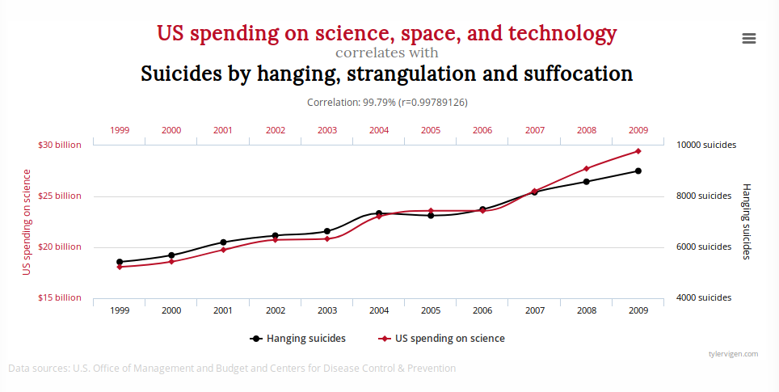
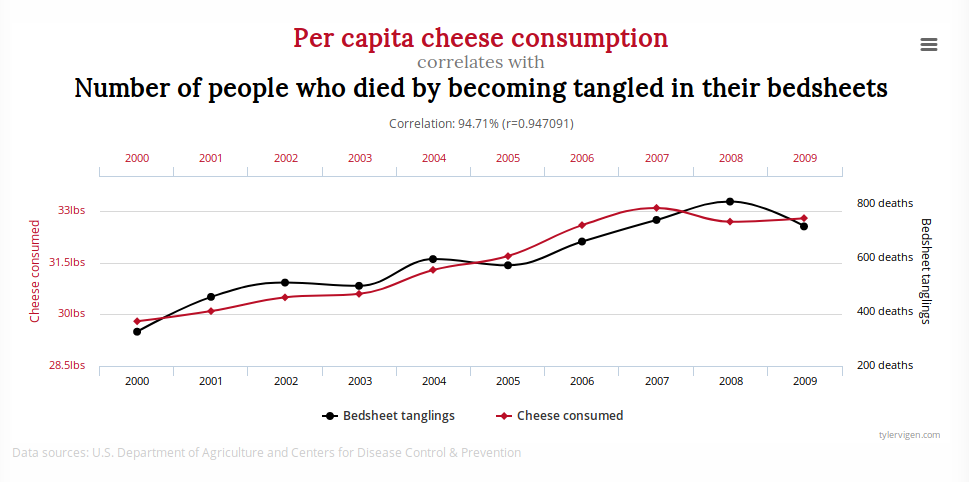

<style type="text/css">
div.main-container {
  max-width: 1600px;
  margin-left: auto;
  margin-right: auto;
}
</style>

#### Carga de librerías
```{r}
library(tidyverse)
library(GGally)
```

# Motivación y objetivo

Nuestro objetivo va a ser crear un modelo estadístico sencillo que nos permita modelar la relación lineal entre dos variables: una será nuestra variable a explicar y la otra será nuestra variable explicativa. Para eso vamos a ver:

1) El concepto de correlación, su estimación y los tests asociados
2) Las diferencias entre la correlación y causalidad
3) Modelo de Regresión Lineal Simple: breve introducción teorica, interpretación y evaluación.

# Dataset

Vamos a trabajar con el dataset **state.x77** que se encuentra en R. Como es una matriz, lo transformamos a un dataframe con `as.data.frame()`

```{r}
estados <- state.x77 %>% as.data.frame() %>% rename(life_exp = `Life Exp`, hs_grad=`HS Grad`)
```

Para conocer el dataset utilicemos `?state.x77` para abrir la ayuda de R y la funcion `glimpse()` para ver la estructura de nuestros datos.

```{r}
?state.x77
glimpse(estados)
```

Tenemos 50 observaciones (los 50 estados de Estados Unidos) y 8 variables númericas:

* population: población
* income: ingreso per capita
* illiteracy: porcentaje de la población que es analfabeta
* Life Exp: esperanza de vida en años 
* Murder: cantidad de homicidios cada 100.000 habitantes
* HS Grad: porcentaje de la población que terminó la secundaria
* Frost: promedio de días con temperatura mínima por debajo de los 0 grados
* Area: area en millas cuadradas

Veamos algunas estadisticas de resumen para conocer un poco más nuestras variables:

```{r cars}
summary(estados)
```

# Covarianza y correlacion

## Covarianza

### Definicion

Es un estadistico que permite medir la variabilidad conjunta de 2 variables.

Nos permite medir la asociacion lineal entre dos variables.

La formula de calculo es esta medida es:

$q= \frac{1}{N-1} \sum\limits_{i=1}^N (x_i-\bar{x})(y_i-\bar{y})$

* Cuando valores altos de **x** corresponden a valores altos de **y**, y valores bajos de **x** corresponden a valores bajos de **y** la COVARIANZA es positiva

* Cuando valores altos de **x** corresponden a valores bajos de **y**, y valores bajos de **x** corresponden a valores altos de **y** la COVARIANZA es negativa

* Cuando no ocurre ninguna de las dos cosas anteriores, la covarianza sera muy cercana a cero

### Interpretacion grafica

A continuacion presentamos algunos graficos de dispersion entre variables del dataset de estados.

**ASOCIACION POSITIVA**

* En el eje horizontal se encuentra la variable Asesinatos (Murder) y en el eje vertical se encuentra la variable Analfabetismo (Illiteracy)

* Un punto representa las mediciones de esas dos variables para un estado

* La linea vertical punteada marca el promedio de Asesinatos (Murder)

* La linea horizontal punteada marca el promedio de Analfabetismo (Illiteracy)

```{r}
ggplot(estados, aes(x=Murder,y=Illiteracy)) + geom_point(size=2) +
  geom_hline(yintercept = mean(estados$Illiteracy),color='steelblue', linetype='dashed', size=1) +
  geom_vline(xintercept = mean(estados$Murder), color='steelblue', linetype='dashed', size=1) +
  annotate(geom='text', x=c(6.5,8.3,15,15), y=c(2.9,2.9,1.5,0.8), label='+', colour='forestgreen', size=19) +
  annotate(geom='text', x=c(6.5,8.3,0,0), y=c(0.3,0.3,1.5,0.8), label='-', colour='firebrick', size=27) +
  labs(title='Asociacion positiva', x='Asesinatos (Murder)', y='Analfabetismo (Illiteracy)')+
  theme_bw() + scale_y_continuous(limits = c(0,3)) + scale_x_continuous(limits = c(0,16))
```

**ASOCIACION NEGATIVA**

* En el eje horizontal se encuentra la variable Asesinatos (Murder) y en el eje vertical se encuentra la variable Life Exp (Experanza de Vida)

* Un punto representa las mediciones de esas dos variables para un estado

* La linea vertical punteada marca el promedio de Asesinatos (Murder)

* La linea horizontal punteada marca el promedio de Life Exp (Experanza de Vida)


```{r}
ggplot(estados, aes(x=Murder,y=life_exp)) + geom_point(size=2) +
  geom_hline(yintercept = mean(estados$life_exp), color='steelblue', linetype='dashed', size=1, alpha=0.7) +
  geom_vline(xintercept = mean(estados$Murder), color='steelblue', linetype='dashed', size=1, alpha=0.7) +
  annotate(geom='text', x=c(6.5,8.3,15,15), y=c(74.2,74.2,71.7,70.1), label='+', colour='forestgreen', size=19) +
  annotate(geom='text', x=c(6.5,8.3,0,0), y=c(67.9,67.9,71.7,70.1), label='-', colour='firebrick', size=27) +
  labs(title='Asociacion negativa', x='Asesinatos (Murder)', y='Life Exp (Experanza Vida)')+
  theme_bw() +
  scale_x_continuous(limits = c(0,16)) + scale_y_continuous(limits = c(67.5,74.5))
```

**SIN ASOCIACION LINEAL**

* En el eje horizontal se encuentra la variable Area y en el eje vertical se encuentra la variable Analfabetismo (Illiteracy)

* Un punto representa las mediciones de esas dos variables para un estado

* La linea vertical punteada marca el promedio de Area

* La linea horizontal punteada marca el promedio de Analfabetismo (Illiteracy)

```{r}
ggplot(estados, aes(x=Area,y=Illiteracy)) + geom_point(size=2) +
  geom_hline(yintercept = mean(estados$Illiteracy),color='steelblue', linetype='dashed', size=1) +
  geom_vline(xintercept = mean(estados$Area), color='steelblue', linetype='dashed', size=1) +
  annotate(geom='text', x=c(-10000,150000,500000,500000), y=c(2.9,2.9,1.5,0.8), label='+', colour='forestgreen', size=19) +
  annotate(geom='text', x=c(0,150000,-400000,-400000), y=c(-0.6,-0.6,1.5,0.8), label='-', colour='firebrick', size=27) +
  labs(title='Sin asociacion lineal',y='Analfabetismo (Illiteracy)')+
  theme_bw() + scale_y_continuous(limits = c(-1,3)) + scale_x_continuous(limits = c(-400000,600000))
```

La covarianza tiene una CARACTERISTICA que puede ser un PROBLEMA importante: se ve afectada por la unidad de medida de las variables.

La funcion `cov` permite calcular la covarianza entre dos variables.

Por ejemplo:

```{r}
# Covarianza entre area (medida en millas cuadradas) y analfabetismo
cov_1 = cov(x = estados$Area, y=estados$Illiteracy)
cov_1
# 1 milla cuadrada = 2.59 kilometros cuadrados
area_kilometros = estados$Area*2.59
# Covarianza entre area (medida en kilometros cuadradas) y analfabetismo
cov_2=cov(x = area_kilometros, y=estados$Illiteracy)
cov_2
```

La covarianza entre el area y analfabetismo es distinta dependiendo como midamos el area. Si la medimos en millas cuadras la covarianza es 4018.3 y si la medimos en kilometros cuadrados es igual a 10407.5. 

Como la covarianza se ve afectada por la unidad de medida de las variables puede ser muy dificil (o imposible) realizar una comparacion entre las covarianzas de distintas variables. Para eso podemos utilizar otra medida

## Correlacion

### Definicion

Al igual que la covarianza, la correlacion nos permite medir la asociacion lineal entre dos variables.

La formula de calculo para el coeficiente de correlacion es:

$r= \frac{1}{N-1} \sum\limits_{i=1}^N \frac{(x_i-\bar{x})(y_i-\bar{y})}{S_x \cdot S_y}$

$S_x$ es el desvio estandar estimado de X y $S_y$ es el desvio estandar estimado de Y.

Al agregar los desvios, la correlacion solo puede tomar valores entre -1 y 1 y asi se resuelve el problema que tiene la covarianza de verse afectada por la unidad de medida de las variables

### Caracteristicas

  1) Puede tomar valores entre -1 y 1

  2) No se ve afectada por las unidades de medida de las variables

  3) El valor absoluto (modulo) del coeficiente mide la fuerza de la relacion lineal entre X e y. Cuanto mayor sea el valor absoluto, mas fuerte es la relacion LINEAL entre X e Y

  4) a) $r=1$ indica una relacion lineal perfecta positiva (los puntos se encuentra una recta diagonal de pendiente positiva)
     b) $r=0$ indica que no existe relacion lineal entre X e Y 
     c) $r=-1$ indica una relacion lineal perfecta negativa (los puntos se encuentra una recta diagonal de pendiente negativa)
     
Veamos la caracteristica 2) con nuestro ejemplo de la relacion entre analfabetismo y area

La funcion `cor` permite calcular la correlacion entre dos variables.

```{r}
# Correlacion entre area (medida en millas cuadradas) y analfabetismo
corr_1 = cor(x = estados$Area, y=estados$Illiteracy)
corr_1
# 1 milla cuadrada = 2.59 kilometros cuadrados
area_kilometros = estados$Area*2.59
# Correlacion entre area (medida en kilometros cuadradas) y analfabetismo
corr_2=cor(x = area_kilometros, y=estados$Illiteracy)
corr_2
```

Vemos que ambos coeficientes de correlacion son iguales.

### Ejemplos

Veamos el coeficiente de correlacion para las relaciones que graficamos antes:

```{r}
# Correlacion entre homicidios y analfabetismo
corr_positiva = cor(x = estados$Murder, y=estados$Illiteracy)
corr_positiva
```
Existe una correlacion positiva fuerte entre la cantidad de homicidios y el porcentaje de analfabetas


```{r}
# Correlacion entre homicidios y esperanza de vida
corr_negativa = cor(x = estados$Murder, y=estados$life_exp)
corr_negativa
```

Existe una correlacion negativa fuerte entre la cantidad de homicidios y la esperanza de vida

```{r}
# Covarianza entre area (medida en kilometros cuadradas) y analfabetismo
corr_nula = cor(x = estados$Area, y=estados$Illiteracy)
corr_nula
```

### GGAlly

La libreria **GGally** es muy util porque nos permite resumir informacion sobre las relaciones de las variables de manera grafica.

Con el comando `ggpairs` vamos a poder ver:

1) **En la diagonal**: los graficos de distribucion de la variable

2) **Por debajo de la diagonal**: Los graficos de dispersion para cada par de variables

3) **Por encima de la diagonal**: Los coeficientes de correlacion para cada par de variables 


```{r, message=FALSE}

ggpairs(estados) + theme_bw() + theme(axis.text.x = element_text(angle = 90, hjust = 1))
```


### Tests

El coeficiente de correlacion es el resultado de una estimacion sobre nuestro conjunto de datos. Por lo tanto, el numero que se obtiene va a depender de que individuos fueron seleccionados en la muestra.

Veamos esto con un ejemplo

```{r}
# Sacamos el promedio de días con temperatura mínima por debajo de los 0 grados para los 50 estados
mean(estados$Frost)
# Sacamos la correlacion entre dias debajo de los 0 grados (Frost) y el analfabetismo 
cor(estados$Frost, estados$Illiteracy)

#Seleccionamos los 10 estados mas frios 
frios= estados %>% arrange(desc(Frost)) %>% slice(1:10)
# Sacamos el promedio de días con temperatura mínima por debajo de los 0 grados para esos 10 estados
mean(frios$Frost)
# Sacamos la correlacion entre dias debajo de los 0 grados (Frost) y el analfabetismo para esos 10 estados
cor(frios$Frost, frios$Illiteracy)

# Ahora seleccionamos los 10 estados mas calidos 
calidos= estados %>% arrange(desc(Frost)) %>% slice(41:50)
# Sacamos el promedio de días con temperatura mínima por debajo de los 0 grados para esos 10 estados
mean(calidos$Frost)
cor(calidos$Frost, calidos$Illiteracy)
```

Considerando los 50 estados vemos que en promedio tienen 104 días por debajo de 0 grados y la correlación entre días fríos y analfabetismo es negativa y bastante fuerte (igual a -0.67)

Los 10 estados mas frios tienen en promedio 170 dias por debajo de los 0 grados (casi la mitad del año) mientras los 10 estados más cálidos tienen en promedio 24 días por debajo de los 0 grados (menos de un mes).

Por su parte vemos que la correlación entre días fríos y analfabetismo es muy cercana a 0 (es igual a 0.02) para los estados más fríos, mientras que para los estados más cálidos la correlación es negativa y baja (es igual a -0.19).

En conclusion, vemos que el coeficiente de correlacion puede cambiar mucho dependiendo de que individuos hayamos incluido en nuestro dataset (muestra)

# Correlacion vs causalidad

La correlacion mide el grado de asociacion lineal entre dos variables.

La CAUSALIDAD indica que una variable o variables (variables predictoras/exogenas/explicativas) sirven para explicar el comportamiento de otra variable (variable a predecir/endogena/ a explicar)

Puede haber variables con una baja (o nula) correlacion, y sin embargo que exista otro tipo de relacion entre ellas. Como tambien pueden existir variables con una alta correlacion pero que no podamos explicar el vinculo entre ellas.

Para este segundo caso, podemos clasificarlo en dos situaciones:

1) **Correlacion espuria**: dos variables tienen una correlacion elevada por motivos puramente azarosos

2) **Variables ocultas**: dos variables tienen una correlacion elevada porque hay informacion "escondida" en alguna de ellas (o en ambas)

Veamos algunos ejemplos para aclarar la situacion

     

   

Ejemplo de `estados` con Frost vs Illiteracy

```{r}
ggplot(estados, aes(x=Frost,y=Illiteracy)) + geom_point(size=2) +
  geom_hline(yintercept = mean(estados$Illiteracy),color='steelblue', linetype='dashed', size=1) +
  geom_vline(xintercept = mean(estados$Frost), color='steelblue', linetype='dashed', size=1) +
  labs(title='Asociacion positiva')+
  theme_bw() + scale_y_continuous(limits = c(-1,3)) + scale_x_continuous(limits = c(-10,200))
```


# Modelo

## Definicion

## Modelo en R

### Interpretacion

### Evaluacion
